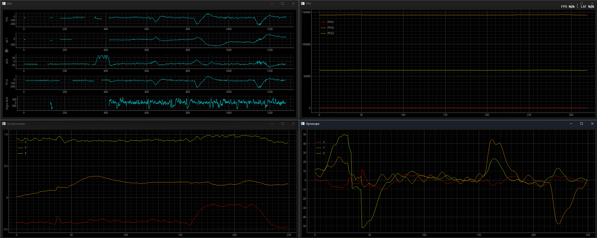
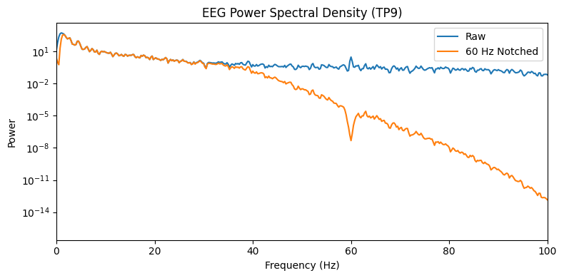
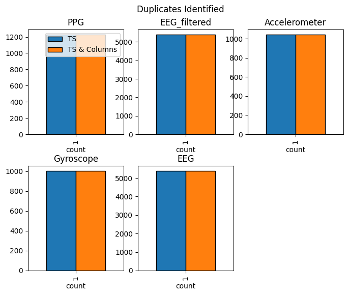
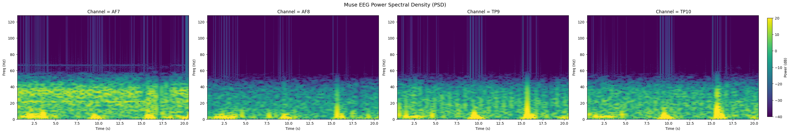
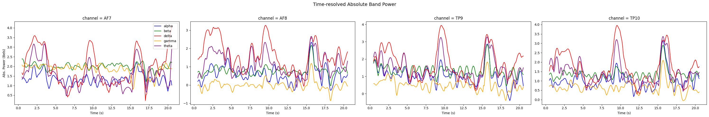

# Record Muse

A collection of Python packages for reading EEG, Accelerometer, Gyroscope, and PPG data from a Muse S or Muse 2 devices by InteraXon Inc. This tool allows you to:

1. Recording LSL streams emitted by applications such as [BlueMuse](https://github.com/kowalej/BlueMuse), [Petal Metrics](https://petal.tech/downloads), and [Mind Monitor](https://mind-monitor.com/).
2. Perform basic plotting, duplicate record analysis, and format conversions.

## Functions

<details>
<summary><h3>Demo-ing: <code>demo.py</code></h3></summary>

```bash
python demo.py
```

This script allows you to visualize the data streams _without recording data_ - hence, it's purely a demo operation. For recording, check out the next function: `record.py`.



_**NOTE**: It is NOT safe to call this script BEFORE you start your LSL stream. I recommend running this script only AFTER your LSL stream is already on._

</details>

<details>
<summary><h3>Recording: <code>record.py</code></h3></summary>

```bash
python record.py [-d <OUTPUT_DIR>]
```

This script records the EEG, Accelerometer, Gyroscope, and PPG data simultaneously and outputs the streams as CSV files. It's multi-threaded (meaning that stream sampling and file saving are separate threads). It also provides visualizations of the current streams, similar to `demo.py`.

_**NOTE**: This script auto-generates an output directory, but if you want you can declare your own output directory via the optional argument `-d`. If a directory already exists with the same name, it appends a number system to the inputted directory and increments until a duplicate directory is no longer detected._

_**NOTE**: It is NOT safe to call this script BEFORE you start your LSL stream. I recommend running this script only AFTER your LSL stream is already on._

</details>

<details>
<summary><h3>Filtering: <code>filter.py</code></h3></summary>

```bash
python filter.py <path/to/eeg.csv> [-b]
```

This script looks at the EEG file generated from `src/record.py` and applies a 60Hz notch filter. This 60Hz notch filter is needed to counteract impedence caused by electrical components in the Muse device. This script can also apply a bandpass filter from 1-40Hz as a way to offset incredibly high Gamma frequencies. This can be toggled by adding a `-b` flag to your command.

To validate whether the operation was successful, a plot is generated and saved that lets you look at the Power Spectral Density (PSD) of the TP9 signal both before and after the filtering. You should see something similar to that shown below:



_**NOTE**: You do not need to run this while you are recording. In fact, you're expected to run this immediately after recording your Muse data._

</details>

<details>
<summary></h3>Normalizing: <code>normalize.py</code></h3></summary>

```bash
python normalize.py <path/to/rest/eeg> <path/to/query/eeg> [-tc <timestamp column>] [-sb <start/buffer/time>] [-eb <end/buffer/time>] [-v]
```

This script normalizes your EEG to a mean of 0 and standard deviation of 1 PER CHANNEL - which thus maintains cross-channel relationships while standardizing all data to an even analysis playing field. Naturally, this script requires 2 arguments: a path to your rest-state EEG data, and a path to your query EEG data. Several optional parameters are provided. You can dictate:

1. `-tc`: Which column is the timestamp column, 
2. `-sb` and `-eb`: The start and end buffer amounts 
    - e.g. `-sb 5` means you want to remove the first 5 time units from your rest-state EEG
    - e.g. `-eb 5` means you remove the last 5 time units from your rest-state EEG
3. `-v`: We offer a post-normalization validation check where your raw query EEG and its normalized variant are compared in 3 different ways: 
    1. _Mean and Standard Deviation_: Each channel in the normalized data should be normalized to a mean of 0 and a standard deviation of 1.
    2. _Distribution Shape_: The distributions of each channel are compared between their raw and normalized variants; distribution histograms should look the same.
    3. _Frequency Distribution Check_: We perform a simple welch PSD calculation on both the raw and normalized data; though their powers should be at a different scale, their shapes should remain the same.

</details>

<details>
<summary><h3>Validating: <code>validate.py</code></h3></summary>

```bash
python validate.py <path/to/directory> [-tc <timestamp/column/name>] [-p]
```

This script checks all files present in a given directory and does the following:

1. Produces plots of the raw data, and saves them in a new `plots/` directory.
2. Calculates consecutive duplicates and records them.

This is needed if you wish to confirm whether the samples you are getting are actually following the listed sample rates according to Muse documentation. This is especially important for streaming apps like _Mind Monitor_ where it's been identified that timestamps are not really accurate.



_**NOTE**: This will only search the IMMEDIATE directory you provide, so nested subdirectories will not have their csv files detected. If there are any specific files you want to IGNORE instead, there is a global config variable inside `src//validate.py` you can modify for your own purposes.

</details>

<details>
<summary><h3>Conver from Mind Monitor to BlueMuse: <code>convert.py</code></h3></summary>

```bash
python convert.py <path/to/muse/csv>
```

Mind Monitor may give you a single `.csv` file that contains all the raw EEG data, accelerometer data, gyroscope data, and ppg data. If you want to convert this into a format more befitting this toolkit's expected format (i.e. the BlueMuse data formats, where each stream its its own `.csv` file), then you can use this script.

</details>

<details>
<summary><h3>Power Spectral Density: <code>psd.py</code></h3></summary>

```bash
python psd.py <path/to/eeg.csv>
```

This script calculates the PSD and bandpowers of a given EEG csv file. It's recommended to use EEG data that has at least been filtered by `filter.py`.




_**NOTE**: This script will REMOVE YOUR ORIGINAL TIMESTAMPS and replace it with a relative `time` column. So if you have any time-based analysis, make sure to properly crop your EEG data time-wise prior to running this operations!_

</details>

## Installation

### Step 1: Set up an LSL stream

There are some options out there for you, sorted in descending recommendation:

1. [**BlueMuse**](https://github.com/kowalej/BlueMuse): The _recommended_ way of outputting an LSL stream of Muse data.
2. [Mind Monitor](https://mind-monitor.com/): An all-in-one package that also provides in-built recording functions, though timestamp accuracy is restricted.
3. [Petal Metrics](https://petal.tech/downloads): A viable alternative that also provides in-built recording, though with many caveats such as recording pausing when an EEG channel is interrupted.

Here are the basic rundowns of their functions:

|Application|LSL Stream Output|In-Built Recording|Requires Payment|Caveats|
|:-:|:-:|:-:|:-:|:-|
|**BluseMuse**|:ballot_box_with_check:|:x:|:x:|No in-built recording|
|Mind Monitor|:ballot_box_with_check:|:ballot_box_with_check:|:dollar:|Timestamps are packaged and lossy|
|Petal Metrics|:ballot_box_with_check:|:ballot_box_with_check:|:dollar:|Stops recording when signals are interrupted|

_This assumes that you are using **BlueMuse** for your LSL stream setup._

### Step 2: Install a virtual environment and dependencies

All dependencies are provided in `requirements.txt`. It's safest to set up a virtual Python environment first. This has been tested in Python `3.11`.

```bash
# Virtual environment `.venv` setup (Windows)
py -m venv .venv
.venv/Scripts/activate
# Virtual environment `.venv` setup (Mac / Linux)
python -m venv .venv
source .venv/bin/activate

# Installing dependencies via pip
pip install -r requirements.txt

# Commands (covered above)
# ...

# Closing the virtual environment
deactivate
```

#### WARNING: Execution Policy and Permissions

If you attempt to activate your virtual environment and you get the error below, then you need to double-check that you have execution policy permissions allowed.

Firstly, open up a PowerShell window in Administrator Mode. Then, double-check the output of this command. You are likely to see the following:

```bash
# Run this Command
Get-ExecutionPolicy -List

# Likely Output
Scope ExecutionPolicy
----- ---------------
MachinePolicy       Undefined
   UserPolicy       Undefined
      Process       Undefined
  CurrentUser       Undefined   # <-- This should be "RemoteSigned", but it isn't...
 LocalMachine    RemoteSigned
```

To change this, run the following command:

```bash
Set-ExecutionPolicy RemoteSigned -Scope CurrentUser
```

You can double-check once more if the permission has been applied to "CurrentUser" - if so, then you're golden.

### Step 3: Record

This is a two-step process:

1. Start streaming from whichever streaming application you've decided on.
2. Start recording via `record.py`
3. Do whatever task or operation you want while recording
4. After ceasing recording, run `filter.py` to perform a basic 60Hz notch filter, as well as 1-40Hz bandpass if you so choose.
5. Perform whatever operations needed to slice the EEG, Accelerometer, Gyroscope, and PPG data time-wise (i.e. align your data prior).
6. use `psd.py` to calculate the power spectral density (PSD) and time-series Bandpowers of your filtered, sliced EEG data.