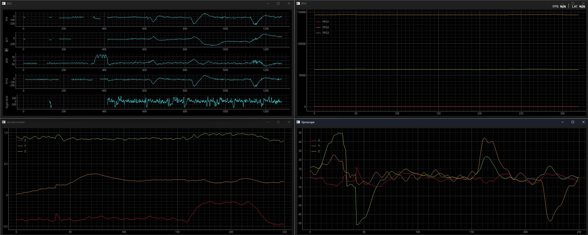
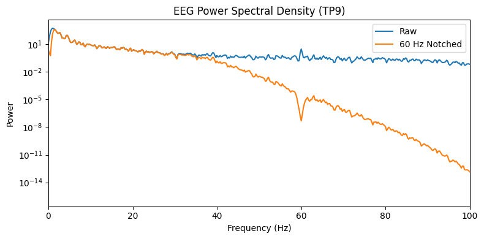
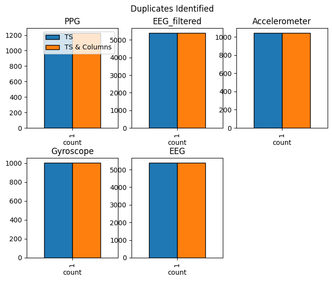
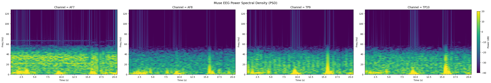
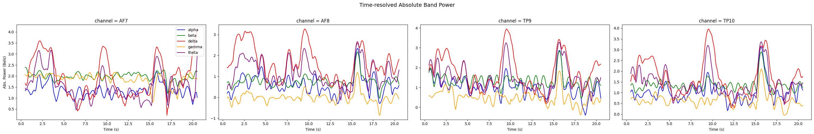

# RecordMuse - Methodology

## Recording Data: `record/`

This covers anything related to recording data from LSL streams and handling raw data prior to **processing**.

### Debugging Preset Configs: `record/stream_info.py`

```bash
python record/stream_info.py [-h] [-c CONFIG_FILEPATH]

Check what data streams an active LSL software is outputting, 
and contrast that with known presets.

options:
  -h, --help            show this help message and exit
  -c CONFIG_FILEPATH, --config_filepath CONFIG_FILEPATH
                        Path to the query `.yaml` configuration file.
                        Default=`record/stream_presets.yaml`.
```

This script looks at a specific file, `record/stream_presets.yaml`, and cross-references it with the stream output of either _BlueMuse_ or _Petal Metrics_. It provides the initial experimentation and debug code to check if _RecordMuse_ can properly detect which preset, among several, to follow when recording or demo-ing LSL streams. Users can also modify this file or create their own `.yaml` file to generate a unique stream config.


### Demo-ing: `record/demo.py`

```bash
python ./record/demo.py [-h] [-c CONFIG]

Demo data collection from an LSL streaming software like _BlueMuse_ or _Petal Metrics_.

options:
  -h, --help            show this help message and exit
  -c CONFIG, --config CONFIG
                        Path to a preset configuration `.yaml` file that is used to identify which streams to record.
                        Default='record/stream_presets.yaml'.
```

This script allows you to visualize the data streams _without recording data_ - hence, it's purely a demo operation. It is NOT safe to call this script BEFORE you start your LSL stream; you must run this script only AFTER your LSL stream is already on.



### Recording: `record/record.py`

```bash
python record/record.py [-h] [-c CONFIG] [-d DIR] [-rd RECORD_DURATION] [-v]

Record LSL streams of Muse devices. You can provide an output directory if needed.

options:
  -h, --help            show this help message and exit
  -c CONFIG, --config CONFIG
                        Path to a preset configuration `.yaml` file that is used to identify which streams to record.
                        Default='record/stream_presets.yaml'.
  -d DIR, --dir DIR     Provide an output directory where all files are to be saved.
  -rd RECORD_DURATION, --record_duration RECORD_DURATION
                        If toggled, you can define for how long the recording runs for, in seconds.
  -v, --visualize       Enable live visualization (PyQtGraph windows). Disabling visualizations may help with improving performance.
```

This script records the EEG, Accelerometer, Gyroscope, and PPG data simultaneously and outputs the streams as CSV files. It's multi-threaded (meaning that stream sampling and file saving are separate threads). It also provides visualizations of the current streams, similar to `demo.py`. Also like `demo.py`, it is NOT safe to call this script BEFORE you start your LSL stream; you must run this script only AFTER your LSL stream is already on.

_**NOTE**: This script auto-generates an output directory, but if you want you can declare your own output directory via the optional argument `-d`. If a directory already exists with the same name, it appends a number system to the inputted directory and increments until a duplicate directory is no longer detected._

---

## Processing Data: `processing/`

These scripts cover everything from coverting _Mind Monitor_ data into the _BlueMuse_ format, filtering noisy frequencies, and normalizing EEG based on a provided resting-state EEG sample.

### Convert from Mind Monitor to BlueMuse: `processing/convert.py`

```bash
python processing/convert.py [-h] [-od OUTPUT_DIR] [-gbc {last,first}] target

Convert raw muse data from Mind Monitor into BlueMuse format

positional arguments:
  target                Relative path to the muse csv file that needs to be converted

options:
  -h, --help            show this help message and exit
  -od OUTPUT_DIR, --output_dir OUTPUT_DIR
                        The name of the output directory, which will be created relative to the same directory as the target file
  -gbc {last,first}, --groupby_choice {last,first}
                        Should we groupby and then use the last or first?
```

_Mind Monitor_ may give you a single `.csv` file that contains all the raw EEG data, accelerometer data, gyroscope data, and ppg data. If you want to convert this into a format more befitting this toolkit's expected format (i.e. _BlueMuse_'s data formats, where each stream its its own `.csv` file), then you can use this script.

### Filtering: `processing/filter.py`

```bash
python processing/filter.py [-h] [-b] [-op OUTPATH] [-v] filepath

Filters 60Hz notch with a provided EEG file outputted from `record.py`.

positional arguments:
  filepath              Provide the relative filepath to your raw EEG file.

options:
  -h, --help            show this help message and exit
  -b, --apply_bandpass  Should we apply bandpass filtering?
  -op OUTPATH, --outpath OUTPATH
                        Providing the path to where the filtered EEG ought to be saved. Can be either a filepath (with extension) or just a directory.  
  -v, --verbose         Print statements to track how the operation is going?
```

This script looks at the EEG file generated from `src/record.py` and applies a 60Hz notch filter. This 60Hz notch filter is needed to counteract impedence caused by electrical components in the Muse device. This script can also apply a bandpass filter from 1-40Hz as a way to offset incredibly high Gamma frequencies. This can be toggled by adding a `-b` flag to your command.

To validate whether the operation was successful, a plot is generated and saved that lets you look at the Power Spectral Density (PSD) of the TP9 signal both before and after the filtering. You should see something similar to that shown below:



_**NOTE**: You do not need to run this while you are recording. In fact, you're expected to run this immediately after recording your Muse data._


### Normalizing: `processing/normalize.py`

```bash
python processing/normalize.py [-h] [-tc TS_COL] [-sb START_BUFFER] [-eb END_BUFFER] [-od OUTDIR] [-v] rest_src eeg_src

Normalize an EEG file based on a rest-state EEG sample

positional arguments:
  rest_src              The resting state EEG sample, as a csv file.
  eeg_src               The EEG csv file to normalize

options:
  -h, --help            show this help message and exit
  -tc TS_COL, --ts_col TS_COL
                        The timestamp column
  -sb START_BUFFER, --start_buffer START_BUFFER
                        The time buffer to cull out from the beginning of the rest-state EEG
  -eb END_BUFFER, --end_buffer END_BUFFER
                        The time buffer to cull out from the end of the rest-state EEG
  -od OUTDIR, --outdir OUTDIR
                        The output directory where to save the normalized EEG data. Can be left blank.
  -v, --validate        Should we validate if the normalization is correct?
```

This script normalizes your EEG to a mean of 0 and standard deviation of 1 PER CHANNEL - which thus maintains cross-channel relationships while standardizing all data to an even analysis playing field. Naturally, this script requires 2 arguments: a path to your rest-state EEG data, and a path to your query EEG data. Several optional parameters are provided. You can dictate:

1. `-tc`: Which column is the timestamp column, 
2. `-sb` and `-eb`: The start and end buffer amounts 
    - e.g. `-sb 5` means you want to remove the first 5 time units from your rest-state EEG
    - e.g. `-eb 5` means you remove the last 5 time units from your rest-state EEG
3. `-v`: We offer a post-normalization validation check where your raw query EEG and its normalized variant are compared in 3 different ways: 
    1. _Mean and Standard Deviation_: Each channel in the normalized data should be normalized to a mean of 0 and a standard deviation of 1.
    2. _Distribution Shape_: The distributions of each channel are compared between their raw and normalized variants; distribution histograms should look the same.
    3. _Frequency Distribution Check_: We perform a simple welch PSD calculation on both the raw and normalized data; though their powers should be at a different scale, their shapes should remain the same.

---

## Analyzing Data: `analysis/`

These scripts are purely focused towards research analysis. This includes having validation tools to check if duplicates exist in your data (as a sanity check) and performing power spectral density analysis.

### Validating: `analysis/validate.py`

```bash
python analysis/validate.py [-h] [-tc TIMESTAMP_COLNAME] [-wl] [-p] src

Validates all files in a provided directory. These include finding duplicates and producing raw data plots.

positional arguments:
  src                   The directory where your EEG, Accelerometer, and Gyroscope data are stored.

options:
  -h, --help            show this help message and exit
  -tc TIMESTAMP_COLNAME, --timestamp_colname TIMESTAMP_COLNAME
                        The representative timestamp to identify duplicates with
  -wl, --with_lines     When plotting raw plots, should we also render lines to connect raw scatter points?
  -p, --preview         Should we show the duplicate plot at the end?
```

This script checks all files present in a given directory and does the following:

1. Produces plots of the raw data, and saves them in a new `plots/` directory.
2. Calculates consecutive duplicates and records them.

This is needed if you wish to confirm whether the samples you are getting are actually following the listed sample rates according to Muse documentation. This is especially important for streaming apps like _Mind Monitor_ where it's been identified that timestamps are not really accurate.



_**NOTE**: This will only search the IMMEDIATE directory you provide, so nested subdirectories will not have their csv files detected. If there are any specific files you want to IGNORE instead, there is a global config variable inside `validate.py` you can modify for your own purposes._

### Power Spectral Density: `analysis/psd.py`

```bash
python analysis/psd.py [-h] src

Produces PSD plots, based on EEG data. Recommend to filter first using `filter.py`.

positional arguments:
  src         Provide the relative filepath to your raw EEG file.

options:
  -h, --help  show this help message and exit
```

This script calculates the PSD and bandpowers of a given EEG csv file. It's recommended to use EEG data that has at least been filtered by `filter.py`.




_**NOTE**: This script will REMOVE YOUR ORIGINAL TIMESTAMPS and replace it with a relative `time` column. So if you have any time-based analysis, make sure to properly crop your EEG data time-wise prior to running this operations!_